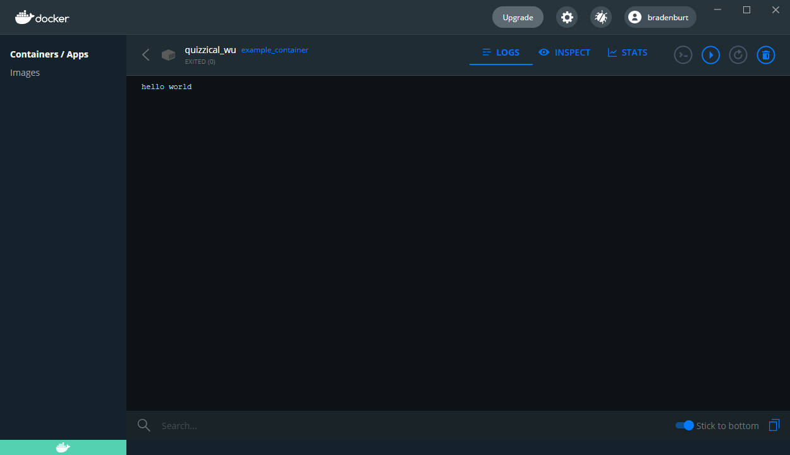

# docker_modifying

Modifying and adding elements to a container.

## Basics

### The Dockerfile

The Dockerfile is the starting place for any custom image or container. Within this file, anything we need from an image or container can be specified. There are hundreds of thousands of ways to specify the makeup of a Docker container, and it is very customizable. In this way, a container is much like Legos. There are an infinite number of ways that Legos can go together, combining some pieces with others or omitting pieces. This is how a Docker container is as well. I think that this analogy will better explain it.

> A Dockerfile is to a container what a homemade instruction manual is to a Lego set.

This analogy is a way to look at a Dockerfile. A store bought Lego set comes with instuctions on how to configure that certain set to look like what is on the box. That's a Docker Hub supported image, someone has already done the work for us. But when we build something really cool out of the millions of possible Lego configurations, we could make ourselves an instruction manual to be able to make it again. A Dockerfile can be used over and over again to produce an image, which yields the final result of a container.

### Anatomy of a Dockerfile

Certain characteristics of a Dockerfile must be included in order to compile the image into a container. The order will be shown down below, but let's dive into what some of these characteristics are. This will be a surface level overview. For a more in depth look into what some of these charactersitics are read [this file here](https://gist.github.com/adamveld12/4815792fadf119ef41bd). 

*FROM* - First, we must specify what base image we will be using. This can be compared to an OS, and actually can be a OS. Basically, the backbone the container will be running on. The OS that the container runs on can vary greatly, such as Python or Ubuntu, but is mostly important for any dependencies that the other attribute of the container will run on. To pick a base image, visit [Docker Hub](hub.docker.com) and search for which one you would like to use. For example, we could use Python like so:

```docker
FROM python:<Version>
```

We can specify a version here if needed, or use "python:latest" to use the latest stable version available on Docker Hub. 

*RUN* - Next, a crucial part that we must have is some command that is going to run when we make this. Conveniently, this is the *RUN* command. This could be anything from making a directory inside the container to installing Ubuntu applications such as Vim. If we are using an OS, then it must be formatted in the that OS's way, for example with a base image as Ubuntu:

```docker
RUN apt-get install vim
```

*Expose* - Running this on a port. In this class previously we have used ports like 8080, 4040 and so on in order to run the docker container. Be careful not to choose ports that would override any ports already being run.

```docker
EXPOSE 2000
```

*CMD* - If we need anything run right away upon starting the image or container, then this is the command to do it. 

##### Useful Extras

*WORKDIR* - This is what sets the working directory inside of our container if we want/need to.

*USER* - To add a user we would run the following

```docker
USER <username>
```
*ADD* - An option here would be to copy over local/remote files into the container. This would be here when the container is created, if necessary. An example being a Python virtual environment, listing all packages and versions. 

```docker
ADD <src> <dest>
```

### Dockerfile in use

As an example, this [Dockerfile](/Dockerfile) will give a simple example of a file that can be made into an image, then into a container. This example is so simple that it might seem unhelpful, but it contains the basic commands needed to build the image and make it into a container. 

This example of a Dockerfile contains the important parts to make the image and container run. To summarise:

```docker
FROM     # a base image
RUN      # a series of commands
EXPOSE   #use a certain port to run
CMD      # a simple output
```

Once the Dockerfile is set and ready to go, we can build it into an image by running the following command in a terminal or command prompt while Docker is running. This may take a while, but this has now created an image for our use. "-t" is the *tag*, which is the name that you call the image, in this case I called it "example_container". "-f" points it into the direction of the Dockerfile that is being used to build the image. The code to run is below:

```bash
docker build -t example_container -f Dockerfile .
```

Once the image is made, we can actually run it as a container. The command below is what actually makes the container, and once it is made we can use this command to start it again and again. 

```bash
docker run -it example_container
```

Here is my output:

> C:\git\docker_modifying> docker run -it example_container
> hello world

Running this container right here is not very exciting as it only contains one command, but if this was an application it would run until we stop it. To help with understanding, here is how it looks in the Docker Desktop application.




## Modifying
